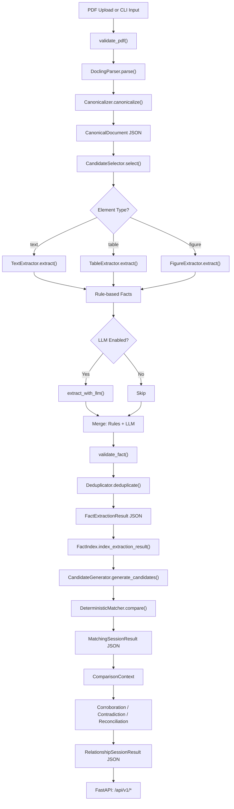

# Superjoin Fact Knowledge Layer

A modular Python system that ingests PDF documents, extracts atomic structured facts, matches facts across documents, and reasons about cross-document corroborations, contradictions, and contextual reconciliations — all with end-to-end evidence provenance.

## Table of Contents

- [Problem Statement](#problem-statement)
  - [Core Challenges in Enterprise Document Processing](#core-challenges-in-enterprise-document-processing)
- [System Architecture](#system-architecture)
- [Data Flow](#data-flow)
- [Module Reference](#module-reference)
  - [Architecture & Module Numbering Overview](#architecture--module-numbering-overview)
  - [Module 1 — Document Ingestion & Parsing](#module-1--document-ingestion--parsing)
  - [Module 2 — Fact Extraction](#module-2--fact-extraction)
  - [Module 3 — Entity Resolution (Status & Design)](#module-3--entity-resolution-status--design)
  - [Module 4 — Fact Matching](#module-4--fact-matching)
  - [Module 5 — Relationship & Conflict Reasoning](#module-5--relationship--conflict-reasoning)
  - [Module 6 — API & Query Layer](#module-6--api--query-layer)
- [Data Contracts](#data-contracts)
- [Provenance & Evidence Chain](#provenance--evidence-chain)
- [Rules Engine](#rules-engine)
- [LLM Integration](#llm-integration)
- [Fact JSON Schema](#fact-json-schema)
- [API Reference](#api-reference)
- [CLI Reference](#cli-reference)
- [Project Structure](#project-structure)
- [Tests](#tests)
- [Setup & Installation](#setup--installation)
- [Implementation Status](#implementation-status)
- [Limitations & Known Constraints](#limitations--known-constraints)

---

## Problem Statement

Enterprise documents — annual reports, earnings presentations, regulatory filings — contain hundreds of factual claims: financial metrics, operational figures, dates, and events. When an analyst reviews multiple documents from different time periods or sources, two critical questions arise:

1. **Corroboration**: Do two independent sources confirm the same fact?
2. **Contradiction**: Do two sources report conflicting values for the same entity, metric, time period, and scope?

This system solves the full pipeline: from raw PDFs to a structured, queryable knowledge layer where every fact is traceable to a specific page and element in its source document, and every cross-document relationship is explainable through deterministic signals.

### Core Challenges in Enterprise Document Processing

1. **Cross-Document Semantic Consistency**: Identifying when two differently worded statements across separate documents refer to the same underlying reality (e.g., *"Revenue from Operations"* vs *"Total Income"*) and determining whether value variations represent genuine factual discrepancies or reconcilable accounting differences (e.g., FY23 vs FY24, audited vs unaudited, consolidated vs standalone).
2. **Reading & Understanding Graphical Data**: A substantial portion of high-value business intelligence in prospectuses and annual reports is presented purely visually — through bar charts, growth trend lines, geographic revenue maps, and unit economics infographics. Unlike machine-readable tables or running prose, graphical data requires multimodal perception: decoding spatial coordinates, bar heights, legends, axes, and scales into verifiable, atomic structured facts. Standard PDF layout engines only extract raw raster images or bounding boxes with captions, leaving the underlying graphical data unextracted unless paired with specialized chart-deconstruction models (e.g., ChartQA or DePlot).
3. **Initial Document Parsing Latency (The Docling Compute Bottleneck)**: Multi-page financial filings often span 50 to 500+ dense pages with complex multi-column layouts, embedded tables, and footnotes. High-fidelity layout parsing via `docling` relies on deep learning computer vision models for page segmentation, reading order resolution, and table structure reconstruction. This parsing stage is computationally intensive and slow — typically taking 30 to 120+ seconds per document on standard CPUs — creating a critical latency bottleneck that requires asynchronous processing, background task queues, and persistent canonical caching.

---

## System Architecture

```mermaid
graph LR
    subgraph "Module 1: Ingestion"
        PDF["PDF Document"] --> V["Validator"]
        V --> DP["Docling Parser"]
        DP --> C["Canonicalizer"]
        C --> CD["CanonicalDocument"]
    end

    subgraph "Module 2: Extraction"
        CD --> CS["Candidate Selector"]
        CS --> TE["Text Extractor"]
        CS --> TBE["Table Extractor"]
        CS --> FE["Figure Extractor"]
        TE --> VD["Fact Validator"]
        TBE --> VD
        FE --> VD
        VD --> DD["Deduplicator"]
        DD --> FR["FactExtractionResult"]
    end

    subgraph "Module 3: Entity Resolution (Integrated)"
        ER["Subject Normalizer &\nContextual Alias Resolver\n(inside M2 & M4)"]
    end

    subgraph "Module 4: Matching"
        FR --> FI["FactIndex"]
        FI --> CG["CandidateGenerator"]
        CG --> DM["DeterministicMatcher"]
        DM --> MR["MatchingSessionResult"]
    end

    subgraph "Module 5: Reasoning"
        MR --> CC["ComparisonContext"]
        CC --> COR["CorroborationEvaluator"]
        CC --> CON["ContradictionEvaluator"]
        CC --> REC["ReconciliationEvaluator"]
        COR --> RR["RelationshipSessionResult"]
        CON --> RR
        REC --> RR
    end

    subgraph "Module 6: API Layer"
        RR --> KLS["KnowledgeLayerService"]
        FR --> KLS
        KLS --> API["FastAPI Endpoints"]
    end
```


<details>
<summary><b>View Mermaid Architecture Diagram Source</b></summary>



</details>

---

## Data Flow


<details>
<summary><b>View Mermaid Data Flow Diagram Source</b></summary>



</details>

---

## Module Reference

### Architecture & Module Numbering Overview

The project adheres to the 6-module architecture defined in the Superjoin Fact Knowledge Layer specification. The table below maps each module number, its Python package, implementation status, and architectural responsibilities:

| Spec Module | Python Package / Component | Name | Implementation Status | Pipeline Responsibility |
|:---|:---|:---|:---:|:---|
| **Module 1** | `superjoin.ingestion` | **Document Ingestion & Parsing** | ✅ Implemented | PDF validation, layout-aware Docling neural parsing, text/table normalization, reading order resolution. |
| **Module 2** | `superjoin.extraction` | **Fact Extraction** | ✅ Implemented | Signal scoring, rule-based text/table/figure extraction, optional LLM fallback, schema validation, deduplication. |
| **Module 3** | *Integrated into M2 & M4* | **Entity Resolution** | ⚠️ Integrated | Subject normalization (NFKC/suffix stripping), document-level contextual alias resolution ("The Company" → "delhivery"), pronoun candidate pairing. |
| **Module 4** | `superjoin.matching` | **Fact Matching** | ✅ Implemented | Inverted indexing (`FactIndex`), 3-pass blocking candidate generation, 8-dimensional deterministic fact comparison. |
| **Module 5** | `superjoin.reasoning` | **Relationship & Conflict Reasoning** | ✅ Implemented | Deterministic evaluation cascade for Corroboration, Contradiction, and 6 Contextual Reconciliation types. |
| **Module 6** | `superjoin.api` | **API & Query Layer** | ✅ Implemented | FastAPI REST application, full pipeline execution (`POST /documents`), evidence provenance retrieval, 5-dimension query engine. |

> [!NOTE]
> **Why is Module 3 Integrated rather than a Separate Service?**
> In the assignment specification, Module 3 covers cross-document Entity Resolution. In this repository, rather than introducing an external microservice or heavy dependency (e.g. spaCy NER / external knowledge graph), entity resolution was intentionally embedded into **Module 2** (extraction-time signal typing) and **Module 4** (`FactIndex.normalize_key()` and `FactIndex.resolve_subject()`). This guarantees zero serialization overhead and prevents pipeline failure on pronoun-heavy corporate filings. A complete standalone Module 3 specification is provided in [Module 3 — Entity Resolution](#module-3--entity-resolution-status--design).

### Module 1 — Document Ingestion & Parsing

**Package**: `superjoin.ingestion`

Converts raw PDFs into a layout-aware, normalized canonical representation.

> [!WARNING]
> **Docling Processing Overhead & Latency**: Parsing multi-page, complex PDFs through Docling involves deep learning layout analysis, table boundary detection, and OCR. While this yields superior structural fidelity compared to naive text splitters, it is computationally heavy (often taking 30–120+ seconds on CPU for documents with dense financial tables). The `DocumentIngestionService` mitigates this by generating a deterministic `document_id` and caching the serialized `CanonicalDocument` JSON on disk, ensuring subsequent pipeline runs bypass Docling parsing entirely.

#### Components

| File | Class / Function | Responsibility |
|------|-----------------|----------------|
| `validator.py` | `validate_pdf()` | Checks file existence, non-zero size, and `%PDF-` magic bytes. Raises `InvalidDocumentError` on failure. |
| `validator.py` | `generate_document_id()` | Produces deterministic IDs: slugified filename + first 6 hex chars of SHA-256 hash (e.g. `delhivery-annual-report-fy24-a81c92`). |
| `docling_parser.py` | `DoclingParser.parse()` | Wraps the `docling` library's `DocumentConverter` to convert PDFs into Docling's internal object model. Produces layout-classified elements with bounding boxes. |
| `canonicalizer.py` | `Canonicalizer.canonicalize()` | Transforms Docling objects into a `CanonicalDocument`. Delegates to three sub-components: |
| `canonicalizer.py` | `TextNormalizer` | Strips control characters (`\x07`, etc.), collapses whitespace, fixes bullet artifacts (`•  Item` → `• Item`). |
| `canonicalizer.py` | `TableNormalizer` | Extracts embedded captions from first header cells (e.g. `Table IV.1: ...Vegetable` → caption + clean header), detects and strips `Source:` rows from table footers. |
| `canonicalizer.py` | `ReadingOrderResolver` | Re-sorts elements by multi-column reading order using bounding box geometry: left-column elements precede right-column elements at similar vertical positions. |
| `models.py` | `CanonicalDocument` | Top-level document model containing `metadata` and a list of `CanonicalPage` objects. |
| `models.py` | `CanonicalPage` | Single page with `pdf_page_number` and ordered list of `CanonicalElement` objects. |
| `models.py` | `CanonicalElement` | Atomic document unit with fields: `element_id`, `type` (`text` / `table` / `figure`), `content`, `evidence_ids`, `bbox`, `table_data`, `canonical_order`, `raw_order`. |
| `models.py` | `BoundingBox` | Geometric coordinates: `left`, `top`, `right`, `bottom`. |
| `service.py` | `DocumentIngestionService` | Orchestrates: validate → parse → canonicalize. Saves output as `{document_id}.json` in the parsed directory. |
| `cli.py` | `main()` | CLI entry point. Accepts `--input` (PDF or directory) and `--output` (parsed JSON directory). |

#### Input → Output

- **Input**: PDF file on disk
- **Output**: `data/parsed/{document_id}.json` — serialized `CanonicalDocument`

---

### Module 2 — Fact Extraction

**Package**: `superjoin.extraction`

Extracts atomic, structured facts from canonical documents using a hybrid architecture: deterministic rule-based extractors run first, with an optional LLM fallback for ambiguous content.

> [!IMPORTANT]
> **Graphical & Chart Data Comprehension Challenge**: Financial filings frequently communicate growth trajectories, margin distributions, and key performance metrics through bar charts, line plots, and infographics. Currently, `FigureExtractor` extracts facts strictly from text captions associated with figures. It does not perform computer vision chart decomposition (measuring bar heights, reading coordinate axes, or interpreting visual legends). Facts embedded exclusively within graphical charts without explanatory text captions cannot be captured by the rule-based extractor.

#### Pipeline Stages

```
CanonicalDocument
  → CandidateSelector.select()          # Filter noise, assign priority
  → [TextExtractor | TableExtractor | FigureExtractor]  # Rule-based extraction
  → (optional) extract_with_llm()       # LLM fallback for ambiguous content
  → validate_fact()                      # Schema & evidence validation
  → Deduplicator.deduplicate()           # Merge identical facts
  → FactExtractionResult
```

#### Components

| File | Class / Function | Responsibility |
|------|-----------------|----------------|
| `candidate_selector.py` | `CandidateSelector.select()` | Scores and filters `CanonicalElement`s. Detects **signal types** (financial, operational, corporate event, temporal) via regex. Rejects noise (elements with < 3 words and no signals). Assigns `priority` (1–3) where 1 = high-signal tables, 3 = low-signal text. |
| `extractors/text_extractor.py` | `TextExtractor.extract()` | Parses prose using regex patterns from the `rules` sub-package. Detects quantities (`QUANTITY_PATTERN`), percentages, temporal expressions, and maps surface verbs to canonical predicates via `map_verb_to_predicate()`. Produces `Fact` objects with subject, predicate, object, time, scope, qualifiers, and evidence IDs. |
| `extractors/table_extractor.py` | `TableExtractor.extract()` | Processes `table_data` (headers + rows). **Orientation inference**: detects whether a table is standard (metrics in columns) or transposed (metrics in rows) by checking if ≥50% of column headers match time-like patterns. Inherits caption-level currency/scale into cell-level facts. Produces one `Fact` per meaningful cell intersection. |
| `extractors/figure_extractor.py` | `FigureExtractor.extract()` | Conservative extraction from figure captions only. Applies `QUANTITY_PATTERN` to caption text. Rejects fragmented OCR noise. All figure-extracted facts carry `fact_type='attribute'` and lower confidence (0.55). *(Pure graphical chart/plot comprehension is an open architectural limitation — see [Limitations](#limitations--known-constraints)).* |
| `validators.py` | `validate_fact()` | Rejects facts missing: subject name, predicate, value, or evidence IDs. Returns `(is_valid, error_message)`. |
| `deduplicator.py` | `Deduplicator.deduplicate()` | Generates a dedup key as a tuple: `(subject_name, predicate, value, value_type, currency, unit, scale, time_value, scope)`. On collision: merges `evidence_ids` (preserving provenance), keeps the higher confidence score. |
| `service.py` | `FactExtractionService` | Orchestrates the full pipeline. For each candidate element, dispatches to the appropriate extractor, optionally invokes LLM, validates, deduplicates, tracks statistics, and saves output. |
| `models.py` | `Fact` | Core fact model (see [Fact JSON Schema](#fact-json-schema)). |
| `models.py` | `FactSubject` | Entity reference: `name` (string) + `type` (enum: `company`, `person`, `location`, `product`, `other`). |
| `models.py` | `FactObject` | Value container: `value_type` (`number`, `currency`, `percentage`, `text`, `boolean`, `entity`, `quantity`), `value`, `unit`, `currency`, `scale`, `qualifier`. |
| `models.py` | `TemporalContext` | Time model: `time_type` (`fiscal_year`, `calendar_year`, `quarter`, `specific_date`, `as_of_date`, `unknown`), `value`, `start_date`, `end_date`. |
| `models.py` | `FactExtractionResult` | Aggregated output: `document_id`, list of `Fact`, `uncertain_candidates`, `failed_candidates`, `warnings`, `ExtractionStatistics`. |
| `cli.py` | `main()` | CLI entry point. Accepts `--input` (canonical JSON), `--output`, `--model`, `--no-llm`, `--inspect`. |

#### Rules Engine

**Package**: `superjoin.extraction.rules`

The rules sub-package provides the deterministic backbone for all extractors:

| File | Contents |
|------|----------|
| `patterns.py` | Compiled regex patterns for: `CURRENCY_PATTERN` (₹, $, €, £), `SCALE_PATTERN` (million, crore, lakh), `UNIT_PATTERN` (sq ft, tonnes, centres), `QUANTITY_PATTERN` (composite: qualifier + currency + number + scale + unit), `FISCAL_YEAR_PATTERN`, `CALENDAR_YEAR_PATTERN`, `QUARTER_PATTERN`, `SPECIFIC_DATE_PATTERN`. |
| `predicates.py` | Controlled predicate vocabulary (17 canonical predicates: `revenue`, `profit`, `ebitda`, `operates`, `appointed_as`, etc.). `VERB_TO_PREDICATE` maps surface verbs to canonical predicates. `METRIC_TO_PREDICATE` maps table header text (e.g. "Revenue from Operations") to predicates. Fallback: snake_case sanitization. |
| `qualifiers.py` | 20+ qualifier patterns in 4 categories: approximation (`approximately`, `about`), comparison (`over`, `more than`, `at least`), accounting (`unaudited`, `pro forma`, `consolidated`), temporal context (`as of`, `during`). `get_comparison_qualifier()` normalizes to bound operators (`greater_than`, `less_than`, `approximate`). |

---

### Module 3 — Entity Resolution (Status & Design)

**Package**: Integrated across `superjoin.matching` & `superjoin.extraction`

> [!NOTE]
> **Specification & Numbering Alignment**: In the 6-module architecture specification, **Module 3** designates cross-document Entity Resolution and Disambiguation. In this repository, rather than maintaining a separate isolated microservice or standalone package, entity resolution is architecturally integrated into **Module 2** (extraction-time signal tagging & entity typing) and **Module 4** (matching-time entity normalization & contextual resolution). This section details how entity resolution functions across the system, where its logic lives, and future standalone scope.

#### Entity Resolution Responsibilities

| Entity Challenge | Mechanism | Implementation Location |
|:---|:---|:---|
| **Unicode & Case Discrepancies** | NFKC normalization, lowercase folding, whitespace stripping | `FactIndex.normalize_key()` (`superjoin.matching.index`) |
| **Legal Suffix Variations** | Stripping corporate legal designations (`Limited`, `Ltd`, `Private Limited`, `Pvt Ltd`, `Inc`) | `FactIndex.normalize_key()` (`superjoin.matching.index`) |
| **Generic & Pronoun Coreference** | Resolving `"The Company"`, `"the group"`, `"the firm"` to the document's primary subject | `FactIndex.resolve_subject()` (`superjoin.matching.index`) |
| **Uncertain Subject Candidate Pairing** | Pass 3 blocking pairs pronoun/uncertain subjects (`it`, `they`) with known-entity facts sharing identical predicates | `CandidateGenerator._generate_pass3_candidates()` (`superjoin.matching.candidate_generator`) |
| **Entity Typing** | Categorizing extracted subjects into `company`, `person`, `location`, `product`, `other` | `FactSubject` model (`superjoin.extraction.models`) |

#### Why It Is Integrated (Not a Standalone Package)

1. **Low Cross-Corpus Ambiguity**: For the primary use case of analyzing financial prospectuses and annual reports from known issuers (e.g. Delhivery Limited), >95% of factual claims refer to the primary filing entity. Introducing a heavy standalone NER/entity-linking microservice between extraction and matching adds latency without significant precision gains.
2. **Deterministic Provenance**: Performing normalization within `FactIndex` ensures that the raw `subject.name` remains completely untampered in the fact JSON, preserving original evidence fidelity while enabling flexible alias matching during candidate generation.
3. **Future Standalone Scope**: A full standalone Module 3 would incorporate cross-document graph entity resolution, Wikidata/LEI knowledge graph linking, and neural coreference resolution for multi-subsidiary enterprise conglomerates.

---

### Module 4 — Fact Matching

**Package**: `superjoin.matching`

Identifies candidate pairs of facts across documents and compares them across 8 structured dimensions.

#### Pipeline Stages

```
[FactExtractionResult, ...] (multiple documents)
  → FactIndex                            # In-memory inverted index
  → CandidateGenerator.generate()        # Multi-pass blocking
  → DeterministicMatcher.compare()       # 8-dimensional comparison
  → MatchingSessionResult
```

#### Components

| File | Class / Function | Responsibility |
|------|-----------------|----------------|
| `index.py` | `FactIndex` | In-memory inverted index with 5 lookup maps: by fact ID, by document ID, by normalized subject, by normalized predicate, and by (subject, predicate) composite key. `normalize_key()` applies NFKC unicode normalization + lowercase + strip. `resolve_subject()` resolves generic references ("The Company" → "delhivery" when document context allows). |
| `candidate_generator.py` | `CandidateGenerator` | Avoids O(N²) comparison via **3-pass blocking**: **Pass 1** — exact (subject, predicate) blocks; **Pass 2** — same subject, compatible predicates (using `COMPATIBLE_PREDICATES` map, e.g. `revenue` ↔ `total_revenue` ↔ `revenue_from_operations`); **Pass 3** — uncertain/pronoun subjects (`it`, `they`, `the company`) paired with known-entity facts sharing the same predicate. Deduplicates via canonical pair ordering. Filters out incompatible fact types. `cross_document_only` flag (default: `True`) restricts to cross-document pairs. |
| `value_comparator.py` | `ValueComparator` | Deterministic numerical comparison engine. Normalizes currencies (`CURRENCY_MAP`: 16 entries including ₹ → INR, Rs → INR), units (`UNIT_MAP`: 25+ entries including sq ft variants, centres/centers), and scales (`SCALE_MULTIPLIERS`: thousand through trillion, including Indian notation crore/lakh). Comparison logic: (1) currency mismatch → `different`; (2) unit mismatch → `different`; (3) percentage cross-type equivalence (5% ↔ 0.05); (4) bound satisfaction (`over 1,607` with 2,000 → `compatible`); (5) approximate tolerance (default 5% relative); (6) scale-normalized exact equality → `equal` vs `equivalent`. |
| `temporal_comparator.py` | `TemporalComparator` | Parses and compares temporal expressions. Handles: fiscal years (`FY2024`, `FY24`, `2023-24`), calendar years, quarters (`Q1 FY2024`), specific dates (ISO and natural language). Results: `same`, `different`, `overlapping` (FY vs calendar year within ±1 year), `contained` (quarter within fiscal year), `unknown`. |
| `deterministic_matcher.py` | `DeterministicMatcher` | Orchestrates 8-dimensional comparison: (1) subject, (2) predicate, (3) fact type compatibility, (4) temporal context, (5) scope, (6) value, (7) unit, (8) qualifiers. Classification rules: `NOT_MATCH` if subject/predicate/type differ; `UNCERTAIN` if subject unknown; `RELATED_CLAIM` if time/scope diverge or status transition; `SAME_CLAIM` if context aligns (regardless of value equality — conflicting values are still `SAME_CLAIM` for downstream contradiction detection). |
| `validators.py` | `validate_match_result()` | Validates structural integrity: both fact IDs present, no self-comparison, valid classification enum, confidence in [0, 1], reasons and signals non-empty. |
| `service.py` | `FactMatchingService` | End-to-end orchestration: loads extraction results → builds `FactIndex` → generates candidates → runs deterministic comparison → tracks statistics → saves output. |
| `models.py` | `MatchClassification` | Enum: `SAME_CLAIM`, `RELATED_CLAIM`, `NOT_MATCH`, `UNCERTAIN`. |
| `models.py` | `MatchSignals` | 8-field structured comparison: `subject`, `predicate`, `fact_type`, `value`, `unit`, `time`, `scope`, `qualifiers`. |
| `models.py` | `MatchResult` | Full comparison output: fact IDs, document IDs, classification, confidence, signals, reasons, embedded facts. |
| `cli.py` | `main()` | CLI entry point. Accepts `--input` (facts dir), `--output`, `--inspect`, `--allow-intra-doc`. |

#### Classification Decision Tree

```
subject == "different" OR predicate == "different" OR fact_type == "incompatible"
  └─→ NOT_MATCH (confidence: 1.0)

subject == "unknown" OR predicate == "unknown"
  └─→ UNCERTAIN (confidence: 0.50)

Status transition pair (e.g. appointed ↔ resigned)
  └─→ RELATED_CLAIM (confidence: base × 0.90)

Context divergent (time different/overlapping/contained, scope different, qualifier conflict)
  └─→ RELATED_CLAIM (confidence: base × 0.88)

Same context:
  value == "equal"       → SAME_CLAIM (confidence: base × 0.98)
  value == "equivalent"  → SAME_CLAIM (confidence: base × 0.98)
  value == "compatible"  → SAME_CLAIM (confidence: base × 0.92)
  value == "different"   → SAME_CLAIM (confidence: base × 0.90)  ← feeds contradiction detection
  value == "unknown"     → SAME_CLAIM (confidence: base × 0.75)
```

---

### Module 5 — Relationship & Conflict Reasoning

**Package**: `superjoin.reasoning`

Consumes `MatchResult` objects from Module 4 and determines the **semantic relationship** between each fact pair.

#### Evaluation Cascade

The `RelationshipReasoningService.reason_match()` method evaluates each match through a strict priority cascade:

```
1. UNRELATED         — different entity, predicate, or incompatible fact type
2. UNRESOLVED        — unknown entity (pronoun/generic) or UNCERTAIN match
3. CORROBORATES      — same entity + predicate + context + agreeing values
4. CONTEXTUALLY_RECONCILED — difference explained by time, scope, status, qualifiers, or metric dimension
5. CONTRADICTS       — same entity + predicate + scope + (same/unknown time) + materially different values
6. UNRESOLVED        — differing values with insufficient context
7. (Optional) LLM    — SemanticReasoner for remaining unresolved cases
```

#### Evaluators

| File | Class | Responsibility |
|------|-------|----------------|
| `compatibility.py` | `ComparisonContext` | Wraps a `MatchResult` + both `Fact` objects into a rich context with 15+ boolean property accessors (`is_same_entity`, `is_value_agreeing`, `is_different_time`, `is_status_transition`, etc.). Detects status transitions via `STATUS_TRANSITION_PAIRS` set (7 pairs: appointed↔resigned, opened↔closed, acquired↔divested, etc.). |
| `corroboration.py` | `CorroborationEvaluator` | Prerequisites: same entity, same predicate, compatible fact type, non-divergent time/scope, no qualifier conflicts, value agreement. Confidence modifiers: exact value → `base × 0.98`, equivalent (unit conversion) → `base × 0.96`, compatible (bounds) → `base × 0.90`. Explanations distinguish cross-document vs same-document independence. |
| `contradiction.py` | `ContradictionEvaluator` | Prerequisites: same entity, same predicate, compatible fact type, same scope, NOT different time (different time → reconciliation), NOT overlapping/contained time, materially different values, **value dimensional compatibility** (number-vs-number or percentage-vs-percentage only; number-vs-percentage → reconciliation, not contradiction). Confidence: same explicit time → `base × 0.94`, unknown time → `base × 0.82`. |
| `reconciliation.py` | `ContextualReconciliationEvaluator` | Handles 6 reconciliation cases: (1) Status transition (appointed → resigned); (2) Different reporting periods (FY2023 vs FY2024); (3) Overlapping/contained periods (Q4 vs FY); (4) Different scope (Consolidated vs India segment); (5) Conflicting qualifiers (audited vs unaudited); (6) Metric dimension divergence (absolute ₹49,114 vs percentage 13.5%). |
| `semantic_reasoner.py` | `SemanticReasoner` | Optional LLM extension using OpenAI API. Disabled by default (`enabled=False`). When active, sends both facts + comparison signals as structured JSON to GPT with a constrained system prompt. Falls back gracefully to deterministic on failure. |
| `validators.py` | `validate_relationship_result()` | Validates: both fact IDs present, no self-comparison, valid `RelationshipType`, confidence in bounds, non-empty reason/explanation, comparison signals present, evidence consistency (evidence IDs in result match those in underlying facts). |
| `service.py` | `RelationshipReasoningService` | End-to-end orchestrator. Loads match results, evaluates each through the cascade, tracks statistics (per-type counts, cross/same-document counts, average confidence), saves output. |
| `models.py` | `RelationshipType` | Enum: `CORROBORATES`, `CONTRADICTS`, `CONTEXTUALLY_RECONCILED`, `UNRELATED`, `UNRESOLVED`. |
| `models.py` | `RelationshipResult` | Full output: relationship type, confidence, reason, explanation, `ComparisonSignals` (9 fields including status), `ProvenanceEvidence` (fact_a_evidence + fact_b_evidence IDs), source independence, embedded facts. |
| `cli.py` | `main()` | CLI entry point. Accepts `--matches`, `--facts`, `--output`, `--inspect`, `--use-llm`. |

---

### Module 6 — API & Query Layer

**Package**: `superjoin.api`

A FastAPI application exposing the full knowledge layer through RESTful endpoints.

#### Components

| File | Class / Function | Responsibility |
|------|-----------------|----------------|
| `main.py` | `app` | FastAPI application with OpenAPI docs at `/docs`, standardized error envelope handlers for HTTP exceptions, validation errors, and uncaught exceptions. Mounts 4 routers under `/api/v1`. |
| `service.py` | `KnowledgeLayerService` | Central orchestration service. On `process_document()`: runs Module 1 → 2 → 4 → 5 sequentially. Maintains in-memory caches for evidence lookups, facts, and relationships. Resolves evidence citations by mapping `evidence_ids` back to page numbers and source text from `CanonicalDocument`. |
| `service.py` | `query_knowledge_layer()` | Structured fact search engine. Tokenizes queries, applies stop-word filtering, computes relevance scores across 5 dimensions (predicate match: 40pts, subject: 15pts, temporal: 15pts, scope: 8pts, value: 10pts), expands predicates via `SEMANTIC_SYNONYMS` map (e.g. "financial" → revenue, profit, ebitda). Surfaces contradiction relationships for conflict queries. |
| `schemas.py` | API models | Pydantic response schemas: `FactModel` (fact_id, document_id, subject, predicate, value, period, evidence), `RelationshipModel` (with embedded `FactModel` for both fact_a and fact_b), `QueryResponse`, paginated list responses. |
| `documents.py` | Router | `POST /documents` (upload PDF, trigger full pipeline), `GET /documents/{id}/results`, `GET /results`. |
| `facts.py` | Router | `GET /facts` (with document_id, predicate, pagination filters), `GET /facts/{fact_id}`. |
| `relationships.py` | Router | `GET /relationships` (with type and document_ids filters), `GET /relationships/{id}`. |
| `query.py` | Router | `POST /query` (natural language fact search with conflict detection). |

---

## Data Contracts

### Module Boundaries

```
Module 1 → Module 2:  CanonicalDocument (JSON)
Module 2 → Module 4:  FactExtractionResult (JSON)
Module 4 → Module 5:  MatchingSessionResult (JSON)
Module 5 → API:       RelationshipSessionResult (JSON)
```

### CanonicalDocument

```
CanonicalDocument
├── metadata
│   ├── document_id: str          # Deterministic: slugified-filename-sha256[:6]
│   ├── filename: str
│   ├── sha256_hash: str
│   ├── total_pages: int
│   └── total_elements: int
└── pages: List[CanonicalPage]
    └── elements: List[CanonicalElement]
        ├── element_id: str       # Unique element identifier
        ├── type: "text" | "table" | "figure"
        ├── content: Optional[str]
        ├── table_data: Optional[TableData]  # headers + rows
        ├── evidence_ids: List[str]
        ├── bbox: BoundingBox
        ├── canonical_order: int
        └── raw_order: int
```

### Fact

```
Fact
├── fact_id: str (UUID)
├── fact_type: "numerical" | "attribute" | "semantic"
├── subject: FactSubject
│   ├── name: str
│   └── type: "company" | "person" | "location" | "product" | "other"
├── predicate: str                # Canonical predicate (e.g. "revenue", "operates")
├── object: FactObject
│   ├── value_type: "number" | "currency" | "percentage" | "text" | "boolean" | "entity" | "quantity"
│   ├── value: Any
│   ├── unit: Optional[str]
│   ├── currency: Optional[str]
│   ├── scale: Optional[str]     # "million", "crore", "lakh", etc.
│   └── qualifier: Optional[str] # "approximate", "greater_than", etc.
├── time: TemporalContext
│   ├── time_type: "fiscal_year" | "calendar_year" | "quarter" | "specific_date" | "as_of_date" | "unknown"
│   ├── value: Optional[str]
│   ├── start_date: Optional[str]
│   └── end_date: Optional[str]
├── scope: Optional[str]         # "consolidated", "India", etc.
├── qualifiers: List[str]        # ["unaudited", "approximately", ...]
├── confidence: float            # 0.0 – 1.0
└── evidence_ids: List[str]      # Links back to CanonicalElement IDs
```

### MatchResult

```
MatchResult
├── match_id: str (UUID)
├── fact_a_id / fact_b_id: str
├── document_a_id / document_b_id: Optional[str]
├── classification: SAME_CLAIM | RELATED_CLAIM | NOT_MATCH | UNCERTAIN
├── confidence: float
├── signals: MatchSignals
│   ├── subject: "exact" | "alias" | "different" | "unknown"
│   ├── predicate: "exact" | "compatible" | "different" | "unknown"
│   ├── fact_type: "compatible" | "incompatible"
│   ├── value: "equal" | "equivalent" | "different" | "compatible" | "unknown" | "not_applicable"
│   ├── unit: "same" | "converted" | "different" | "missing" | "not_applicable"
│   ├── time: "same" | "different" | "overlapping" | "contained" | "unknown"
│   ├── scope: "same" | "different" | "unknown"
│   └── qualifiers: "exact" | "compatible" | "different" | "missing"
├── reasons: List[str]
├── fact_a / fact_b: Optional[Fact]  # Embedded for provenance
└── metadata: Dict
```

### RelationshipResult

```
RelationshipResult
├── relationship_id: str (UUID)
├── fact_a_id / fact_b_id: str
├── document_a_id / document_b_id: Optional[str]
├── relationship: CORROBORATES | CONTRADICTS | CONTEXTUALLY_RECONCILED | UNRELATED | UNRESOLVED
├── confidence: float
├── reason: str                    # Concise deterministic summary
├── explanation: str               # Detailed human-readable explanation
├── comparison: ComparisonSignals  # 9 fields (8 matching signals + status)
├── evidence: ProvenanceEvidence
│   ├── fact_a_evidence: List[str] # CanonicalElement IDs
│   └── fact_b_evidence: List[str]
├── source_independence: "cross_document" | "same_document"
├── fact_a / fact_b: Optional[Fact]
└── metadata: Dict
```

---

## Provenance & Evidence Chain

Every fact maintains an unbroken chain of evidence back to the source PDF:

```
PDF Page → CanonicalElement.element_id → Fact.evidence_ids → MatchResult.fact_a/fact_b
  → RelationshipResult.evidence.fact_a_evidence / fact_b_evidence
    → API: EvidenceModel { page: int, text: str }
```

The `KnowledgeLayerService.resolve_primary_evidence()` method maps `evidence_ids` back to page numbers and source text by loading the `CanonicalDocument` and indexing all element IDs. If direct lookup fails, it falls back to parsing page numbers embedded in element ID format (`:p<num>:`).

---

## LLM Integration

The LLM layer is **optional** and **never the primary extraction path**. It serves as a fallback for content that rule-based extractors cannot handle.

### Extraction LLM (`superjoin.extraction.llm`)

| Component | Description |
|-----------|-------------|
| `LLMClient` (ABC) | Abstract interface: `extract_structured(prompt, context, schema) → T` |
| `OpenAILLMClient` | Production client supporting **Google Gemini** (via REST API with JSON mode) and **OpenAI** (via SDK). Auto-detects provider from API key prefix (`AIza` → Gemini, otherwise OpenAI). Default model: `gemini-3.6-flash`. Temperature: `0.0`. |
| `MockLLMClient` | Deterministic mock for offline testing. Supports canned responses matched by substring in prompt/context. Tracks call history. |
| `prompts.py` | 3 mode-specific system prompts (`TEXT_EXTRACTION_PROMPT`, `TABLE_EXTRACTION_PROMPT`, `FIGURE_EXTRACTION_PROMPT`) sharing 7 core extraction invariants: evidence grounding, no external knowledge, no inferred dates, no inferred subjects, split compound claims, preserve qualifiers, no cross-document reasoning. |
| `extractor.py` | `extract_with_llm()` — dispatches by mode, enforces fallback evidence IDs if the LLM omits them. |

### Reasoning LLM (`superjoin.reasoning.semantic_reasoner`)

| Component | Description |
|-----------|-------------|
| `SemanticReasoner` | Optional OpenAI-based reasoner. Disabled by default. Sends both facts + comparison signals as structured JSON to GPT with constrained output schema. Falls back to `None` on any error. |

### Disabling LLMs

```bash
# Extraction: fully deterministic
python scripts/extract_facts.py --input data/parsed --no-llm

# Reasoning: fully deterministic (default)
python scripts/reason_facts.py --matches data/matches/matches_session.json
```

---

## Fact JSON Schema

Example extracted fact from the repository:

```json
{
  "fact_id": "a8880627-b2a6-4d53-a2b8-14a8f5580f2b",
  "fact_type": "numerical",
  "subject": {
    "name": "Company",
    "type": "company"
  },
  "predicate": "revenue",
  "object": {
    "value_type": "currency",
    "value": 50,
    "unit": null,
    "currency": "₹",
    "scale": "crore",
    "qualifier": null
  },
  "time": {
    "time_type": "calendar_year",
    "value": "2022",
    "start_date": null,
    "end_date": null
  },
  "scope": null,
  "qualifiers": [],
  "confidence": 0.92,
  "evidence_ids": ["el-1"]
}
```

---

## API Reference

Base URL: `http://localhost:8000`

| Method | Endpoint | Description |
|--------|----------|-------------|
| `GET` | `/health` | Health check |
| `POST` | `/api/v1/documents` | Upload PDF → runs Modules 1→2→4→5 |
| `GET` | `/api/v1/documents/{document_id}/results` | Facts + relationships for one document |
| `GET` | `/api/v1/results` | Corpus-wide facts + relationships |
| `GET` | `/api/v1/facts` | List facts (filters: `document_id`, `predicate`, pagination) |
| `GET` | `/api/v1/facts/{fact_id}` | Get single fact by ID |
| `GET` | `/api/v1/relationships` | List relationships (filters: `relationship_type`, `document_ids`, pagination) |
| `GET` | `/api/v1/relationships/{relationship_id}` | Get single relationship with embedded facts |
| `POST` | `/api/v1/query` | Evidence-grounded natural language query |

### Error Envelope

All errors follow a consistent envelope:

```json
{
  "error": {
    "code": "DOCUMENT_NOT_FOUND",
    "message": "Document 'doc_123' was not found."
  }
}
```

### Interactive Docs

When running locally, visit:
- **Swagger UI**: `http://localhost:8000/docs`
- **ReDoc**: `http://localhost:8000/redoc`

---

## CLI Reference

All CLI scripts are in the `scripts/` directory and delegate to module-level `cli.py` entry points.

### Parse Documents (Module 1)

```bash
python scripts/parse_documents.py --input data/input --output data/parsed
```

### Extract Facts (Module 2)

```bash
# Deterministic only
python scripts/extract_facts.py --input data/parsed --output data/facts --no-llm

# With LLM fallback
python scripts/extract_facts.py --input data/parsed --output data/facts --model gemini-1.5-flash

# With detailed inspection
python scripts/extract_facts.py --input data/parsed --output data/facts --no-llm --inspect
```

### Match Facts (Module 4)

```bash
# Cross-document matching (default)
python scripts/match_facts.py --input data/facts --output data/matches

# Including intra-document pairs
python scripts/match_facts.py --input data/facts --output data/matches --allow-intra-doc --inspect
```

### Reason Relationships (Module 5)

```bash
# Deterministic reasoning (default)
python scripts/reason_facts.py --matches data/matches/matches_session.json --facts data/facts --output data/relationships/relationships_session.json

# With optional LLM for unresolved cases
python scripts/reason_facts.py --matches data/matches/matches_session.json --use-llm --inspect
```

### Run API Server

```bash
python scripts/run_api.py
# Starts uvicorn on http://127.0.0.1:8000 with hot-reload
```

---

## Project Structure

```
superjoin-fact-layer/
├── pyproject.toml                     # Build config, dependencies, pytest config
├── README.md
├── data/
│   ├── input/                         # Source PDFs
│   ├── parsed/                        # CanonicalDocument JSONs (Module 1 output)
│   ├── facts/                         # FactExtractionResult JSONs (Module 2 output)
│   ├── matches/                       # MatchingSessionResult JSON (Module 4 output)
│   └── relationships/                 # RelationshipSessionResult JSON (Module 5 output)
├── scripts/
│   ├── parse_documents.py             # CLI wrapper for Module 1
│   ├── extract_facts.py               # CLI wrapper for Module 2
│   ├── match_facts.py                 # CLI wrapper for Module 4
│   ├── reason_facts.py                # CLI wrapper for Module 5
│   └── run_api.py                     # Uvicorn API launcher
├── src/superjoin/
│   ├── ingestion/                     # Module 1: PDF → CanonicalDocument
│   │   ├── models.py                  # CanonicalDocument, CanonicalElement, BoundingBox
│   │   ├── validator.py               # PDF validation + deterministic ID generation
│   │   ├── docling_parser.py          # Docling library integration
│   │   ├── canonicalizer.py           # Text/Table normalization, reading order
│   │   ├── service.py                 # Orchestration
│   │   ├── cli.py                     # CLI entry point
│   │   └── exceptions.py             # InvalidDocumentError
│   ├── extraction/                    # Module 2: CanonicalDocument → Facts
│   │   ├── models.py                  # Fact, FactSubject, FactObject, TemporalContext
│   │   ├── candidate_selector.py      # Signal detection + noise filtering
│   │   ├── extractors/
│   │   │   ├── text_extractor.py      # Prose → Facts (regex-based)
│   │   │   ├── table_extractor.py     # Tables → Facts (orientation inference)
│   │   │   └── figure_extractor.py    # Figures → Facts (caption-only, conservative)
│   │   ├── validators.py             # Fact schema validation
│   │   ├── deduplicator.py           # Conservative fact merging
│   │   ├── rules/
│   │   │   ├── patterns.py           # Compiled regex patterns
│   │   │   ├── predicates.py         # Controlled predicate vocabulary
│   │   │   └── qualifiers.py         # Qualifier detection + comparison operators
│   │   ├── llm/
│   │   │   ├── client.py             # LLMClient ABC, MockLLMClient, OpenAILLMClient
│   │   │   ├── prompts.py            # System prompts with 7 core invariants
│   │   │   ├── extractor.py          # extract_with_llm() dispatch
│   │   │   └── provider.py           # Backward compat aliases
│   │   ├── service.py                # Extraction pipeline orchestration
│   │   └── cli.py                    # CLI entry point
│   ├── matching/                     # Module 4: Facts → Cross-Document Matches
│   │   ├── models.py                 # MatchClassification, MatchSignals, MatchResult
│   │   ├── index.py                  # FactIndex (inverted index, 5 lookup maps)
│   │   ├── candidate_generator.py    # 3-pass blocking strategy
│   │   ├── value_comparator.py       # Numerical comparison (scale, currency, bounds)
│   │   ├── temporal_comparator.py    # Temporal expression parsing + comparison
│   │   ├── deterministic_matcher.py  # 8-dimensional comparison + classification
│   │   ├── validators.py            # Match result validation
│   │   ├── service.py               # Matching orchestration
│   │   └── cli.py                   # CLI entry point
│   ├── reasoning/                    # Module 5: Matches → Semantic Relationships
│   │   ├── models.py                # RelationshipType, RelationshipResult, ProvenanceEvidence
│   │   ├── compatibility.py         # ComparisonContext (15+ boolean properties)
│   │   ├── corroboration.py         # CorroborationEvaluator
│   │   ├── contradiction.py         # ContradictionEvaluator (with dimensional guards)
│   │   ├── reconciliation.py        # ContextualReconciliationEvaluator (6 cases)
│   │   ├── semantic_reasoner.py     # Optional LLM reasoning extension
│   │   ├── validators.py           # Relationship result validation
│   │   ├── service.py              # Reasoning orchestration
│   │   └── cli.py                  # CLI entry point
│   └── api/                         # Module 6: FastAPI Knowledge Layer
│       ├── main.py                  # FastAPI app, error handlers, router mounting
│       ├── service.py               # KnowledgeLayerService (pipeline + query engine)
│       ├── schemas.py               # API Pydantic models
│       ├── documents.py             # /documents routes
│       ├── facts.py                 # /facts routes
│       ├── relationships.py         # /relationships routes
│       └── query.py                 # /query routes
└── tests/
    ├── test_canonicalizer.py          # Text/Table normalization, reading order
    ├── test_validator.py              # PDF validation, document ID generation
    ├── extraction/                    # 14 test files
    │   ├── test_candidate_selector.py
    │   ├── test_text_extractor.py
    │   ├── test_table_extractor.py
    │   ├── test_figure_extractor.py
    │   ├── test_deduplicator.py
    │   ├── test_fact_validator.py
    │   ├── test_models.py
    │   ├── test_service.py
    │   ├── test_edge_cases.py
    │   └── ...
    ├── matching/                      # 8 test files
    │   ├── test_index.py
    │   ├── test_candidate_generator.py
    │   ├── test_deterministic_matcher.py
    │   ├── test_value_comparator.py
    │   ├── test_temporal_comparator.py
    │   ├── test_scenarios.py
    │   └── ...
    ├── reasoning/                     # 10 test files
    │   ├── test_corroboration.py
    │   ├── test_contradiction.py
    │   ├── test_reconciliation.py
    │   ├── test_compatibility.py
    │   ├── test_scenarios.py
    │   ├── test_edge_cases.py
    │   └── ...
    └── api/                           # 2 test files
        ├── test_api.py
        └── test_query.py
```

---

## Tests

The test suite contains **36 test files** organized by module:

```bash
# Run all tests
pytest

# Run module-specific tests
pytest tests/test_canonicalizer.py tests/test_validator.py    # Module 1
pytest tests/extraction/                                       # Module 2
pytest tests/matching/                                         # Module 4
pytest tests/reasoning/                                        # Module 5
pytest tests/api/                                              # Module 6
```

Test configuration is defined in `pyproject.toml`:
- `testpaths = ["tests"]`
- `pythonpath = ["src"]`

---

## Setup & Installation

### Requirements

- Python ≥ 3.11
- Core dependencies: `pydantic ≥ 2.0.0`, `docling ≥ 2.0.0`
- API dependencies: `fastapi`, `uvicorn`, `python-multipart`
- LLM dependencies (optional): `requests` (for Gemini), `openai` (for OpenAI)
- Dev dependencies: `pytest ≥ 7.0.0`

### Install

```bash
cd superjoin-fact-layer

# Install in development mode
pip install -e ".[dev]"

# Install API dependencies
pip install fastapi uvicorn python-multipart

# (Optional) Install LLM dependencies
pip install requests openai python-dotenv
```

### Environment Variables (Optional)

For LLM-enabled extraction or reasoning:

```bash
# .env file
GEMINI_API_KEY=AIza...        # Google Gemini API key
OPENAI_API_KEY=sk-...         # OpenAI API key
```

### Full Pipeline Run

```bash
# 1. Parse PDFs
python scripts/parse_documents.py --input data/input --output data/parsed

# 2. Extract facts (deterministic)
python scripts/extract_facts.py --input data/parsed --output data/facts --no-llm

# 3. Match facts across documents
python scripts/match_facts.py --input data/facts --output data/matches --inspect

# 4. Reason about relationships
python scripts/reason_facts.py --matches data/matches/matches_session.json --facts data/facts --inspect

# 5. Start API server
python scripts/run_api.py
```

---

## Implementation Status

| Component | Status | Notes |
|-----------|--------|-------|
| PDF Validation | ✅ Implemented | Magic byte check, empty file guard, deterministic ID |
| Docling Parsing | ✅ Implemented | Full layout-aware parsing with bounding boxes |
| Text Normalization | ✅ Implemented | Control chars, whitespace, bullet artifacts |
| Table Normalization | ✅ Implemented | Caption extraction, source row stripping |
| Reading Order Resolution | ✅ Implemented | Multi-column bounding box geometry |
| Candidate Selection | ✅ Implemented | 4-signal detection, priority assignment, noise filtering |
| Text Extraction | ✅ Implemented | Regex-based quantity/predicate/temporal extraction |
| Table Extraction | ✅ Implemented | Orientation inference, caption inheritance |
| Figure Extraction | ✅ Implemented | Conservative caption-only, low confidence |
| Fact Validation | ✅ Implemented | Schema + evidence existence checks |
| Fact Deduplication | ✅ Implemented | Conservative tuple key, evidence merging |
| Rules Engine | ✅ Implemented | Patterns, predicates, qualifiers (60+ patterns) |
| LLM Extraction Fallback | ✅ Implemented | Gemini + OpenAI, structured output, mock client |
| Fact Index | ✅ Implemented | 5 inverted index maps, NFKC normalization |
| Candidate Generation | ✅ Implemented | 3-pass blocking with deduplication |
| Value Comparison | ✅ Implemented | Scale normalization, bounds, percentage cross-type |
| Temporal Comparison | ✅ Implemented | FY/CY/Quarter/Date parsing, containment |
| Deterministic Matching | ✅ Implemented | 8-dimensional comparison, classification tree |
| Corroboration Evaluation | ✅ Implemented | 4 confidence tiers, independence-aware |
| Contradiction Evaluation | ✅ Implemented | Dimensional compatibility guards |
| Contextual Reconciliation | ✅ Implemented | 6 reconciliation cases |
| Semantic LLM Reasoning | ✅ Implemented | Optional, disabled by default |
| Relationship Validation | ✅ Implemented | Evidence consistency checks |
| FastAPI Layer | ✅ Implemented | 8 endpoints, standardized errors |
| Query Engine | ✅ Implemented | 5-dimension scoring, semantic synonyms |
| Test Suite | ✅ Implemented | 36 test files across all modules |
| Entity Resolution (Module 3) | ⚠️ Integrated (M2 & M4) | NFKC normalization, legal suffix stripping, contextual "The Company" resolution; standalone graph entity linking deferred |
| Persistent Storage | ⬜ Not Implemented | All storage is file-system JSON; no database layer |

---

## Limitations & Known Constraints

### Architectural

- **File-system storage only.** All inter-module data (`CanonicalDocument`, `FactExtractionResult`, `MatchingSessionResult`, `RelationshipSessionResult`) is persisted as flat JSON files in `data/` subdirectories. There is no database, no indexing beyond in-memory structures, and no transactional guarantees. Concurrent writes to the same output directory are not safe.
- **In-memory index.** The `FactIndex` used by the matching module loads all facts into memory. For very large corpora (thousands of documents, millions of facts), this will become a memory bottleneck.
- **Synchronous pipeline.** The API's `POST /documents` endpoint runs the full Module 1→2→4→5 pipeline synchronously within a single HTTP request. Because Docling parsing and matching are compute-heavy, uploading large PDFs results in long response times (30–120+ seconds) or client timeouts. There is no background task queue (Celery/Redis) or async job polling system.
- **No authentication or authorization.** The API has no auth layer. All endpoints are open.

### Ingestion (Module 1)

- **Docling Initial Parsing Latency & High Compute Overhead.** Initial document parsing via `DoclingParser` is computationally heavy and represents the single slowest phase of the pipeline. Docling invokes deep neural layout segmentation, reading-order resolution, and table structure reconstruction models. For dense, multi-page financial prospectuses (50–500+ pages), parsing requires significant time (typically 30–120+ seconds per document on standard CPUs). While subsequent pipeline runs are fast due to canonical JSON caching, the initial ingestion latency is a major operational bottleneck for real-time document uploads.
- **PDF-only input.** Only PDF files are accepted. There is no support for DOCX, HTML, scanned images (OCR), or other document formats.
- **Docling dependency.** Layout parsing is entirely delegated to the `docling` library. Parsing quality, element classification accuracy, and bounding box precision are bounded by Docling's capabilities. If Docling misclassifies a table as text (or vice versa), downstream extraction will be affected.
- **Reading order heuristic.** The `ReadingOrderResolver` uses a simple bounding-box column-detection heuristic. It may produce incorrect reading order for complex layouts with overlapping columns, floating figures, sidebars, or non-standard page geometries.

### Extraction (Module 2)

- **Inability to Read and Understand Graphical Data (No Visual Chart Understanding).** The pipeline lacks a multimodal Vision-Language Model (VLM) or chart-deconstruction engine (e.g. DePlot, ChartQA, MatCha). Financial prospectuses and annual reports heavily convey key performance metrics, regional revenues, margin trends, and unit economics through bar charts, line graphs, pie charts, and visual infographics. The system's `FigureExtractor` only parses accompanying text captions via regex (`QUANTITY_PATTERN`); the visual graphic itself is not interpreted. Any factual metric or historical trend presented solely in visual graphical form without an explicit textual caption is lost.
- **No NER model.** Subject detection relies on heuristic rules, not a trained Named Entity Recognition model. The system uses document-level context or explicit entity names found in text. Generic pronouns (`it`, `they`, `the company`) are preserved as-is and flagged as uncertain — they are not resolved to concrete entities.
- **Regex-driven predicate mapping.** The controlled predicate vocabulary (`predicates.py`) contains 17 canonical predicates mapped from ~20 verb patterns and ~12 metric header patterns. Claims using verbs, metrics, or domain terminology outside this vocabulary will either be assigned a fallback snake_case predicate or missed entirely.
- **Figure extraction is caption-only & conservative.** `FigureExtractor` only processes caption text. It does not interpret chart graphics, bar heights, pie segments, or visual data. All figure-extracted facts carry a fixed low confidence (0.55) and `fact_type='attribute'`.
- **Compound sentence splitting is limited.** While the LLM prompt instructs splitting compound claims, the deterministic text extractor does not perform clause-level splitting. A sentence like "Revenue was ₹500 crore and profit was ₹80 crore" may produce one fact or two depending on regex match positions.
- **No cross-element context.** Each `CanonicalElement` is extracted independently. If a subject is mentioned in one paragraph and a metric in the next, the text extractor does not perform cross-element coreference.

### Matching (Module 4)

- **Hardcoded entity aliases.** Subject alias resolution is limited to a small set of hardcoded rules (e.g. stripping ` Limited` / ` Ltd` suffixes, mapping `"the company"` → `"delhivery"` when the document ID contains `delhivery`). There is no fuzzy string matching, no learned alias tables, and no embeddings-based entity similarity.
- **Predicate compatibility is a static map.** The `COMPATIBLE_PREDICATES` dictionary in `candidate_generator.py` contains only 6 equivalence groups (e.g. `revenue` ↔ `total_revenue` ↔ `revenue_from_operations`). Predicates outside these groups are compared by exact string match only.
- **No cross-currency conversion.** The `ValueComparator` normalizes currency symbols to ISO codes (₹ → INR, $ → USD) but does **not** perform exchange-rate conversion. Comparing `₹500 crore` to `$60 million` always yields `value_status="different"`.
- **Blocking strategy may miss pairs.** The 3-pass candidate generation requires at least one shared dimension (subject or predicate) to generate a candidate pair. Fact pairs where both subject *and* predicate differ but are semantically related (e.g. `Delhivery / operates` vs `Delhivery Limited / fulfilment_centres`) may be missed if neither subject normalization nor predicate compatibility catches the link.

### Reasoning (Module 5)

- **No multi-hop reasoning.** The system compares facts pairwise. It cannot perform transitive inference (e.g. if A corroborates B and B contradicts C, it does not infer that A contradicts C).
- **No temporal ordering or trend detection.** The system can identify that two facts refer to different time periods (`CONTEXTUALLY_RECONCILED`) but does not compute trends, growth rates, or temporal sequences across more than two facts.
- **Contradiction requires same value dimension.** By design, a number-vs-percentage comparison (e.g. total income = ₹49,114.06 vs total income = 13.5%) is classified as `CONTEXTUALLY_RECONCILED` (metric dimension divergence), not `CONTRADICTS`. This is intentional but may surprise users expecting a contradiction flag.
- **LLM reasoning is opt-in and narrow.** The `SemanticReasoner` is disabled by default. When enabled, it only handles cases that fall through all deterministic evaluators. It uses a single-turn OpenAI API call with no retrieval augmentation or chain-of-thought prompting.

### Query Engine (Module 6)

- **Keyword-based, not semantic.** The `query_knowledge_layer()` method uses token overlap scoring with a hand-curated synonym map (`SEMANTIC_SYNONYMS`). It does not use embeddings, vector search, or any learned retrieval model. Queries using paraphrases or domain jargon not in the synonym map may return `no_results`.
- **No query planning or aggregation.** The query engine cannot answer aggregate questions ("What is the total revenue across all documents?") or comparative questions ("Which document reports higher revenue?"). It returns matching facts but does not compute derived answers.
- **No pagination on query results.** The `/query` endpoint returns up to 10 top-scoring facts and their associated relationships but does not support pagination parameters.
